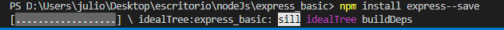

# Mi primer server con Express.js

21 de abril 2022

En esta practica 6 Express Server de la semana 3 de LaunchX-InnovaccionVirtual Mission NodeJS

1. Crea un proyecto nuevo `express_basic`.

- Crea una carpeta con este nombre.
- Ejecuta el comando `npm init` y y da enter hasta que se cree el archivo  `package.json`.

2. Instala la dependencia express: `npm install express --save!`
3. Crea un archivo llamado `app.js` y crea tu primera app de express:
